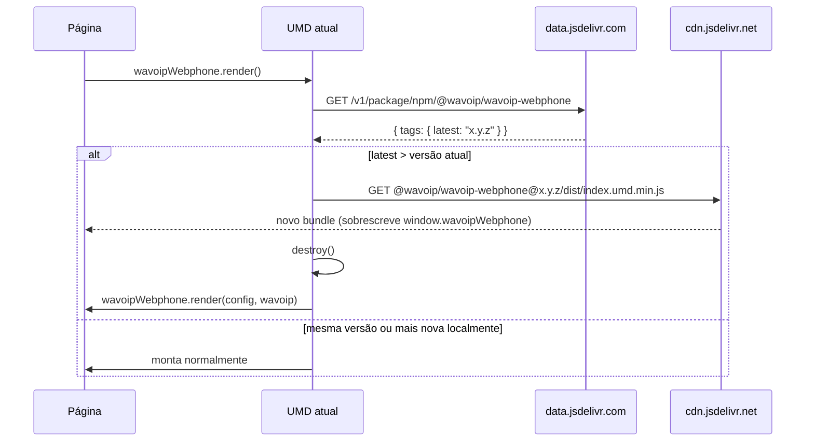

# Auto-atualização da CDN

Quando o webphone é carregado via `<script>` UMD direto da CDN, ele verifica em cada `render()` se uma versão mais recente foi publicada no npm e — se houver — troca o bundle em execução pela versão `latest` antes de montar o componente. O objetivo é garantir que páginas estáticas hospedadas há meses continuem rodando a build atual sem exigir redeploy do HTML.

O recurso está disponível a partir da versão `1.4.4`.

## Quando dispara

O check só roda quando **todas** as condições abaixo são verdadeiras:

1. Existe uma tag `<script>` na página cujo `src` contém `@wavoip/wavoip-webphone` (ou que carrega o atributo `data-wavoip-webphone`).
2. Essa tag **não** tem `data-auto-update="false"`.
3. `render()` é chamado.

Consumidores que instalam o pacote via `npm install` e o importam por bundler **não** acionam o check — não existe `<script>` na página apontando para o pacote, então a função sai cedo sem mexer no DOM nem na rede.

## Fluxo



O `<script>` antigo é removido do DOM após o novo carregar. Em caso de falha (rede, timeout de 15 s, 4xx no jsDelivr), o log emite um warning e o render local prossegue na versão atual — a página nunca fica sem webphone por causa do upgrade.

## Como desativar

Adicione `data-auto-update="false"` à tag `<script>`:

```html
<script
  src="https://cdn.jsdelivr.net/npm/@wavoip/wavoip-webphone@1.4.3/dist/index.umd.min.js"
  data-auto-update="false"
></script>
<script>
  wavoipWebphone.render();
</script>
```

Use essa opção quando:

- O ambiente precisa de auditoria de versão exata (compliance, congelamento de release).
- A integração depende de comportamento específico que pode mudar entre versões minor.
- Você quer evitar o segundo round-trip à CDN no cold start.

## Comportamento por canal

| Canal | Auto-atualização |
| --- | --- |
| `<script src="...@latest/...">` na CDN | Liga por padrão |
| `<script src="...@1.4.3/...">` (versão fixa) na CDN | Liga por padrão — fixar via URL não trava o upgrade |
| `<script ... data-auto-update="false">` | Desligada |
| `import ... from "@wavoip/wavoip-webphone"` (bundler) | Não dispara — fora de escopo |
| `import` direto da URL `cdn.jsdelivr.net/.../index.es.js` | Não dispara — sem tag `<script>` correspondente |

## Comparação de versão

A comparação usa SemVer numérico — `major.minor.patch`. Sufixos de pré-lançamento (`-beta`, `-rc.1`) são ignorados na ordenação. Se a versão local for igual ou maior que `latest`, o upgrade não dispara, então deploys de canary com versão acima da `latest` continuam funcionando.

## Implementação

A lógica vive em `src/lib/auto-update.ts` e é exercitada pelos testes em `src/lib/auto-update.test.ts`. A constante `__WEBPHONE_VERSION__` é injetada em build pelo Vite a partir de `package.json` — o override `WEBPHONE_VERSION_OVERRIDE=<versão>` no `pnpm build` permite simular uma build mais antiga para validar o fluxo localmente.
